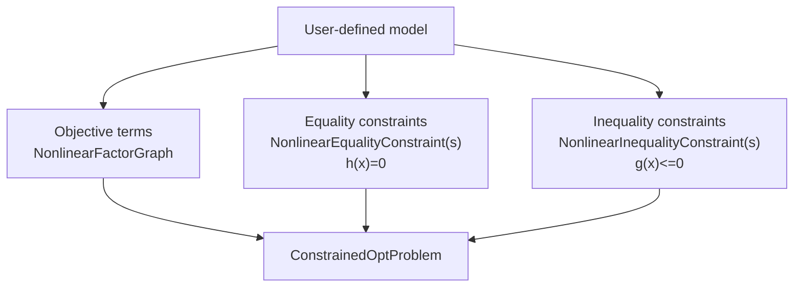
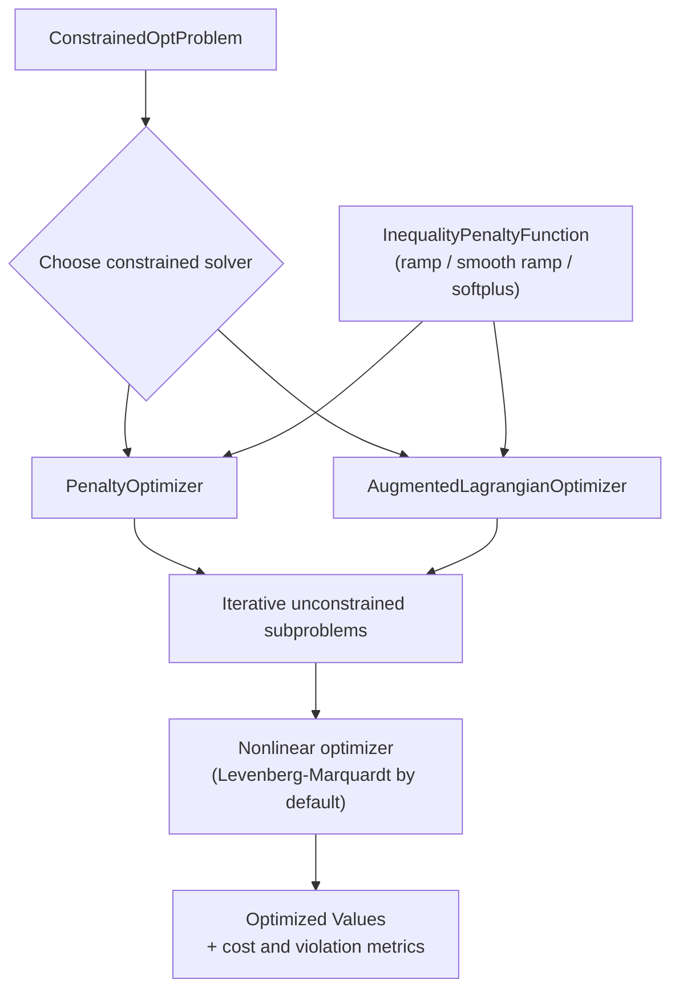

# Constrained

The `constrained` module in GTSAM provides constrained nonlinear optimization on top of factor graphs.
It includes classes for representing constraints, building constrained problems, and solving them with penalty and augmented Lagrangian methods.

## Core Problem Model

- [`ConstrainedOptProblem`](doc/ConstrainedOptProblem.ipynb): Holds objective costs, equality constraints, and inequality constraints.
- [`ConstrainedOptProblem::AuxiliaryKeyGenerator`](doc/ConstrainedOptProblem.ipynb): Generates keys for auxiliary variables used when transforming inequality constraints.
- [`NonlinearConstraint`](doc/NonlinearConstraint.ipynb): Base class for nonlinear constraints represented as constrained `NoiseModelFactor` objects.

## Equality Constraints

- [`NonlinearEqualityConstraint`](doc/NonlinearEqualityConstraint.ipynb): Base class for constraints of the form `h(x) = 0`.
- [`ExpressionEqualityConstraint<T>`](doc/NonlinearEqualityConstraint.ipynb): Equality constraint from an expression and right-hand side.
- [`ZeroCostConstraint`](doc/NonlinearEqualityConstraint.ipynb): Equality constraint that enforces zero residual on a cost factor.
- [`NonlinearEqualityConstraints`](doc/NonlinearEqualityConstraint.ipynb): Container graph for equality constraints.

## Inequality Constraints

- [`NonlinearInequalityConstraint`](doc/NonlinearInequalityConstraint.ipynb): Base class for constraints of the form `g(x) <= 0`.
- [`ScalarExpressionInequalityConstraint`](doc/NonlinearInequalityConstraint.ipynb): Scalar expression-based inequality constraint.
- [`NonlinearInequalityConstraints`](doc/NonlinearInequalityConstraint.ipynb): Container graph for inequality constraints.
- [`InequalityPenaltyFunction`](doc/InequalityPenaltyFunction.ipynb): Interface for ramp-like penalty mappings used with inequality constraints.
  Derived classes:
  - [`RampFunction`](doc/InequalityPenaltyFunction.ipynb)
  - [`SmoothRampPoly2`](doc/InequalityPenaltyFunction.ipynb)
  - [`SmoothRampPoly3`](doc/InequalityPenaltyFunction.ipynb)
  - [`SoftPlusFunction`](doc/InequalityPenaltyFunction.ipynb)

## Optimizers

- [`ConstrainedOptimizerParams`](doc/ConstrainedOptimizer.ipynb), [`ConstrainedOptimizerState`](doc/ConstrainedOptimizer.ipynb), [`ConstrainedOptimizer`](doc/ConstrainedOptimizer.ipynb): Shared base interfaces and iteration state for constrained solvers.
- [`PenaltyOptimizerParams`](doc/PenaltyOptimizer.ipynb), [`PenaltyOptimizerState`](doc/PenaltyOptimizer.ipynb), [`PenaltyOptimizer`](doc/PenaltyOptimizer.ipynb): Penalty method solver and its parameters/state.
- [`AugmentedLagrangianParams`](doc/AugmentedLagrangianOptimizer.ipynb), [`AugmentedLagrangianState`](doc/AugmentedLagrangianOptimizer.ipynb), [`AugmentedLagrangianOptimizer`](doc/AugmentedLagrangianOptimizer.ipynb): Augmented Lagrangian solver and its parameters/state.

## How the Pieces Fit Together

For a new user, it helps to think in two phases:

1. Build a constrained problem.
2. Run a constrained solver on that problem.

Inequality constraints can use different smooth penalty shapes via
`InequalityPenaltyFunction` (ramp, smooth polynomial ramps, or softplus),
which controls behavior near the active constraint boundary.

### 1) Build the Problem

This stage is about modeling: you separate what you want to minimize
(objective terms) from what must hold (constraints), then combine them into a
single `ConstrainedOptProblem` object that the solvers can consume.

### 2) Solve the Problem

This stage is algorithmic: pick a constrained solver, form iterative
unconstrained subproblems internally, and solve those subproblems with a
standard nonlinear optimizer until constraint violation and cost are reduced.

